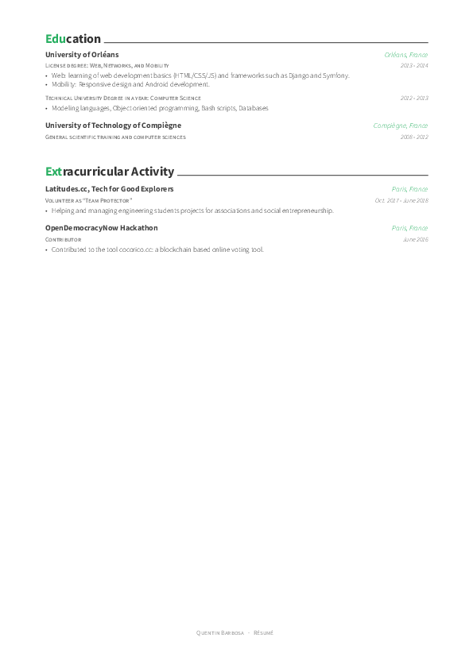

# Curriculum Vitæ

Here is my résumé in both English and French.

It is based on the [Awesome-CV](https://github.com/posquit0/Awesome-CV) template made by [posquit0](https://github.com/posquit0). Many thanks to him!

I publish it under the same license : CC-BY-SA-4.0. Please consult [LICENSE.md](./LICENSE.md) for more details.

[Download PDF version](./Quentin_Barbosa_CV_EN.pdf)

